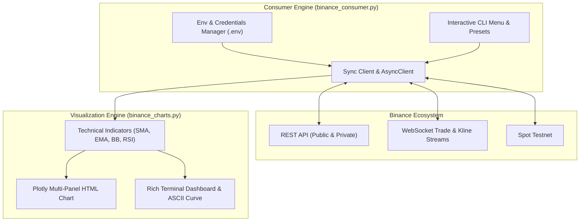

# Binance API Consumer & Market Terminal

[](https://www.python.org/)
[](https://github.com/astral-sh/uv)
[](https://binance-docs.github.io/apidocs/spot/en/)
[](LICENSE)

A production-ready cryptocurrency market terminal and consumer in Python. It provides an interactive CLI menu with presets for popular crypto pairs, intervals, modern multi-panel Plotly browser charts with technical indicators, rich terminal market dashboards, live WebSocket trade streams, and safe order simulation.

---

## Architecture Overview



---

## Key Features

- ⚡ **Interactive CLI User Menu**: Guided terminal navigation with quick preset selections for popular cryptocurrencies (`BTCUSDT`, `ETHUSDT`, `SOLUSDT`, `BNBUSDT`, etc.), time intervals (`1m`, `5m`, `15m`, `1h`, `4h`, `1d`), and candle history counts.
- 📊 **Modern Multi-Panel Interactive Charts**: Professional dark-themed financial charts generated with Plotly and exported to standalone `.html` files:
  - **Panel 1 (Main)**: Interactive Candlesticks + Bollinger Bands (20,2) + SMA 7 / 25 / 99.
  - **Panel 2 (Volume)**: Volume bar chart colored by bullish/bearish candle close + 20-period Volume MA.
  - **Panel 3 (Oscillator)**: Relative Strength Index (RSI 14) with overbought (70) and oversold (30) threshold bands.
- 📈 **Terminal Market Dashboard**: High-density snapshot featuring 24h/period high and low, volume, SMA trend signals, RSI status, recent 5 candles table, and cross-platform safe ASCII price action curves.
- 🔴 **Real-Time Trade Streaming**: Asynchronous WebSocket trade stream using `BinanceSocketManager` with live buy/sell ticker indicators and graceful shutdown on `Ctrl + C`.
- 💰 **Private Account Balances**: Query spot wallet balances and non-zero assets safely.
- 🧪 **Safe Order Simulation**: Place test limit orders via `create_test_order` to validate syntax, precision, and filters without risking funds.
- 🔒 **Security First**: `.env` credential management, automatic Testnet switching, and `.gitignore` protections for secrets and generated charts.
- 🚀 **High-Speed Package Management**: Optimized for [Astral `uv`](https://github.com/astral-sh/uv).

---

## Installation & Setup

### Prerequisites
- Python 3.9 or higher (Python 3.12+ recommended)
- [Astral `uv`](https://github.com/astral-sh/uv) (recommended) or standard `pip`

---

### Option A: Fast Setup with `uv` (Recommended)

```powershell
# 1. Clone the repository
git clone https://github.com/gsolut/bnb-api-demo-01.git
cd bnb-api-demo-01

# 2. Create the virtual environment
uv venv .venv

# 3. Install dependencies
uv pip install -r requirements.txt
```

---

### Option B: Standard Python `venv` + `pip`

#### Windows (PowerShell):
```powershell
# 1. Create and activate virtual environment
python -m venv .venv
.\.venv\Scripts\Activate.ps1

# 2. Install dependencies
pip install -r requirements.txt
```

#### macOS / Linux (Bash):
```bash
# 1. Create and activate virtual environment
python3 -m venv .venv
source .venv/bin/activate

# 2. Install dependencies
pip install -r requirements.txt
```

---

## Configuration

The application works immediately for public market data, charting, and WebSocket streaming without API keys.

To access private account endpoints (balances) or execute test orders, configure your `.env` file:

1. Copy the sample template:
   ```powershell
   Copy-Item .env.example .env
   ```
2. Edit `.env` with your settings:
   ```ini
   # API Credentials (Optional for public market queries & charts)
   BINANCE_API_KEY=your_api_key_here
   BINANCE_API_SECRET=your_api_secret_here

   # Set to 'true' to use Binance Spot Testnet (https://testnet.binance.vision/)
   BINANCE_TESTNET=false

   # Top Level Domain: 'com' for Binance.com, 'us' for Binance.US
   BINANCE_TLD=com
   ```

> [!TIP]
> Never commit your `.env` file to version control. It is already included in `.gitignore`.

---

## Usage Guide

### 1. Interactive CLI Menu Mode (Default)

To start the interactive terminal menu:

```powershell
uv run python binance_consumer.py
```
*(Or within an activated virtual environment: `python binance_consumer.py`)*

```text
┌─────────────────────────────────────────────────────────────┐
│          ⚡ BINANCE API CONSUMER & MARKET TERMINAL ⚡         │
│          Network: Mainnet | TLD: com | Auth: Public Mode    │
└─────────────────────────────────────────────────────────────┘

Select an action:
  1) 📊 Interactive Browser Chart (Plotly HTML + RSI + Bollinger)
  2) 📈 Terminal Market Summary & ASCII Price Action
  3) ⚡ Live WebSocket Real-Time Trade Stream
  4) 🔍 Quick Spot Ticker Price Lookup
  5) 💰 Account Balances & Portfolio Summary
  6) 🧪 Place Safe Test Limit Order
  7) 🚪 Exit
```

#### Quick Preset Selections:
When choosing pairs, timeframes, or history lengths, you can pick from popular presets or type any custom value:

| Setting | Built-in Presets | Custom Input Example |
| :--- | :--- | :--- |
| **Crypto Pairs** | `BTCUSDT`, `ETHUSDT`, `SOLUSDT`, `BNBUSDT`, `XRPUSDT`, `DOGEUSDT`, `ADAUSDT` | `AVAXUSDT`, `NEARUSDT`, `PEPEUSDT` |
| **Time Intervals** | `1m` (Scalp), `5m`, `15m` (Intraday), `1h` (Standard), `4h` (Swing), `1d` (Macro) | `3m`, `30m`, `2h`, `6h`, `12h`, `1w` |
| **History Length**| `30` candles, `60` candles (Default), `100` candles, `200` candles | `500` (up to 1000) |

---

### 2. Direct Command-Line Execution (Batch & Scripting Mode)

You can bypass the interactive menu and trigger specific actions directly using CLI flags:

```powershell
# Generate and open an interactive Plotly HTML chart
uv run python binance_consumer.py --chart -s BTCUSDT -i 1h -l 60
uv run python binance_consumer.py --chart -s SOLUSDT -i 15m -l 100

# Display terminal market dashboard with indicators & ASCII curve
uv run python binance_consumer.py --summary -s ETHUSDT -i 1h -l 40

# Stream live WebSocket trades for a symbol
uv run python binance_consumer.py --stream -s SOLUSDT

# Quick spot ticker price lookup
uv run python binance_consumer.py --ticker -s BNBUSDT

# Check account wallet balances
uv run python binance_consumer.py --balances
```

---

## CLI Flag Reference

| Flag | Short | Default | Description |
| :--- | :--- | :--- | :--- |
| `--symbol` | `-s` | `BTCUSDT` | Cryptocurrency trading pair (e.g. `BTCUSDT`, `ETHUSDT`, `SOLUSDT`) |
| `--interval` | `-i` | `1h` | Candlestick timeframe (`1m`, `5m`, `15m`, `1h`, `4h`, `1d`, etc.) |
| `--limit` | `-l` | `60` | Number of historical candles to fetch (1–1000) |
| `--chart` | | `False` | Fetches klines, generates interactive HTML chart, and opens in default browser |
| `--summary` | | `False` | Prints the terminal market dashboard, technical metrics, and ASCII curve |
| `--stream` | | `False` | Connects to Binance WebSocket trade stream for the chosen symbol |
| `--ticker` | | `False` | Fetches and prints the latest spot price |
| `--balances` | | `False` | Queries private account balances for non-zero assets |
| `--help` | `-h` | | Displays help message and flag specifications |

---

## Technical Indicators & Chart Anatomy

The visualization engine computes the following technical indicators on the fly:

1. **Simple Moving Averages (SMA)**:
   - **SMA 7 (Fast / Gold)**: Short-term momentum.
   - **SMA 25 (Medium / Cyan)**: Intermediate baseline trend.
   - **SMA 99 (Slow / Purple)**: Long-term macro support/resistance.
2. **Exponential Moving Averages (EMA)**:
   - **EMA 12 & EMA 26**: Trend convergence and divergence.
3. **Bollinger Bands (20 periods, 2 std dev)**:
   - Upper and Lower volatility bands with shaded channel overlay.
4. **Relative Strength Index (RSI 14)**:
   - Momentum oscillator with overbought threshold (**70**) and oversold threshold (**30**).
5. **Volume Moving Average (20 periods)**:
   - Identifies institutional volume expansion and liquidity shifts.

---

## Project Structure

```
bnb-api-demo-01/
├── .env.example          # Environment variable template (Mainnet/Testnet/Keys)
├── .gitignore            # Git exclusion rules (.env, .venv, *.html)
├── binance_charts.py     # Technical indicator engine, Plotly charts & terminal UI
├── binance_consumer.py   # Interactive CLI terminal & consumer entrypoint
├── requirements.txt      # Python dependencies
├── LICENSE               # Project license (MIT)
└── README.md             # Project documentation
```

---

## Security, Rate Limits & Best Practices

1. **Never Commit Secrets**: Keep your `BINANCE_API_KEY` and `BINANCE_API_SECRET` strictly in `.env`. Ensure `.env` is always gitignored.
2. **Use Testnet for Development**: When developing trading bots or testing order logic, set `BINANCE_TESTNET=true` and use keys from the [Binance Spot Testnet](https://testnet.binance.vision/).
3. **Rate Limits (IP & Weight)**: Binance enforces request weight limits (1200 weight/minute standard). The `python-binance` library automatically tracks rate limit headers, but always implement exponential backoff for high-frequency direct queries.
4. **WebSocket Connection Management**: Real-time streams are asynchronous and will automatically reconnect on transient drops. Press `Ctrl + C` in your terminal to cleanly close active socket streams.

---

## License

This project is licensed under the [MIT License](LICENSE).
